# gank.io-unofficial-android-client

      

 A Material Design style Gank. Io unofficial client App 一款Material Design风格的Gank.Io非官方客户端应用

## 功能介绍

* 每日干货查看,一键分享保存,分类干货查看,干货搜索.
* Rxjava操作符,中文文档,使用案例,方便随时查阅学习.
* 安卓艺术开发探索读书笔记,EffectiveJava读书笔记.
* 收集各大神博客以及安卓笔记,安卓面试笔记等方便手机端查看.

## 更新说明

### v2.2.2
  * 1.增加了一些最近在学习比较好的安卓大神的博客.
  * 2.增加了来自GeniusVJR整理的安卓面试笔记.
  * 3.优化了一些界面UI效果,以及修复了一些Bug.

### v2.2
  * 1.UI风格修改,更适合阅读.
  * 2.去除了无用代码,代码进行重构工作,持续中.
  * 3.增加了搜索功能,快速查询需要的干货.

### v2.1
  * 1.去除了所有的练习示例代码,现在是一个纯纯的干货客户端.
  * 2.项目整体进行了重构,包结构的修改.
  * 3.去除的代码已移动到个人每日学习代码的提交项目,地址:[AndroidEveryDayPractice](https://github.com/HotBitmapGG/AndroidEveryDayPractice)

 
### v2.0
  * 1.增加了GitHub登录,后期使用GitHub账户来进行用户管理.
  * 2.增加了Gank.Io的干货提交,提交干货更加方便了.
  * 3.整体UI修改,更好的用户体验.
  
  

## APK

## 截图

<a href="art/01.png">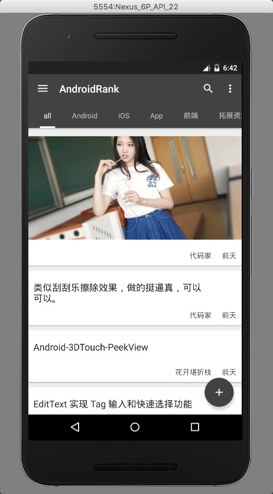</a> <a href="art/02.png">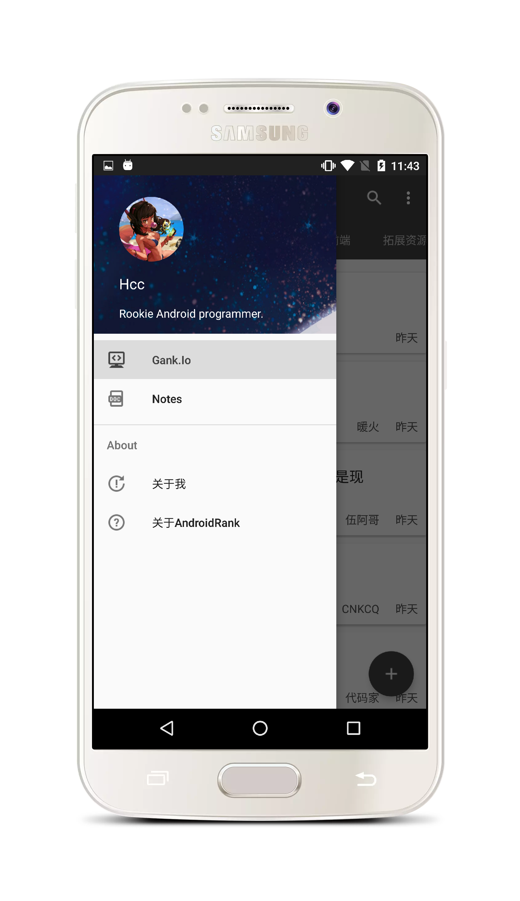</a>

<a href="art/03.png">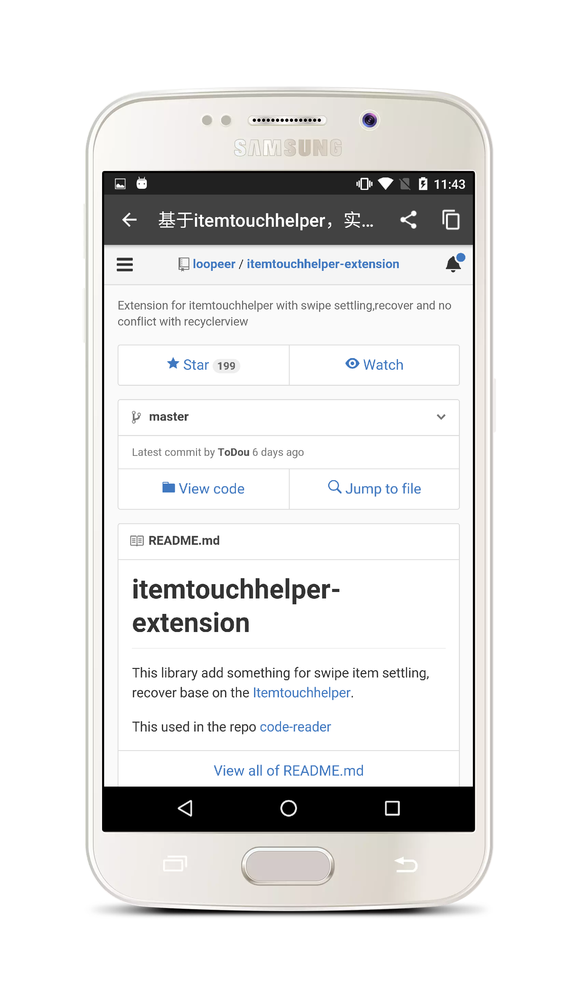</a> <a href="art/04.png">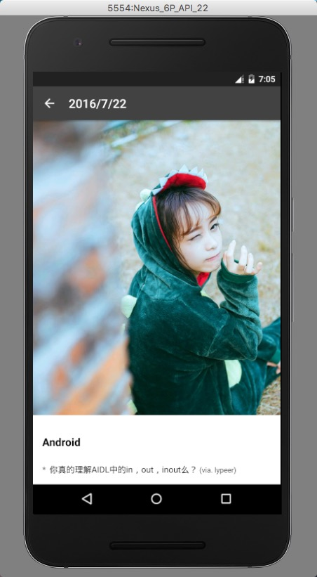</a>

<a href="art/05.png">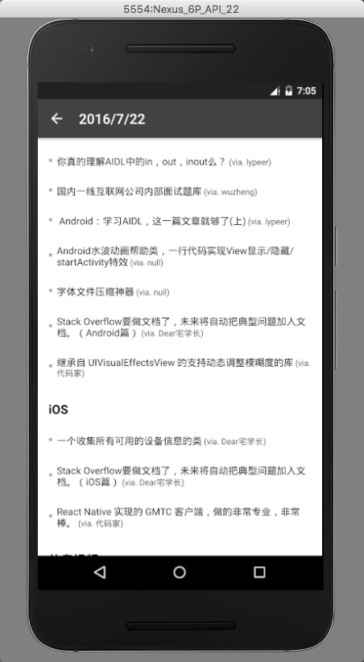</a> <a href="art/06.png">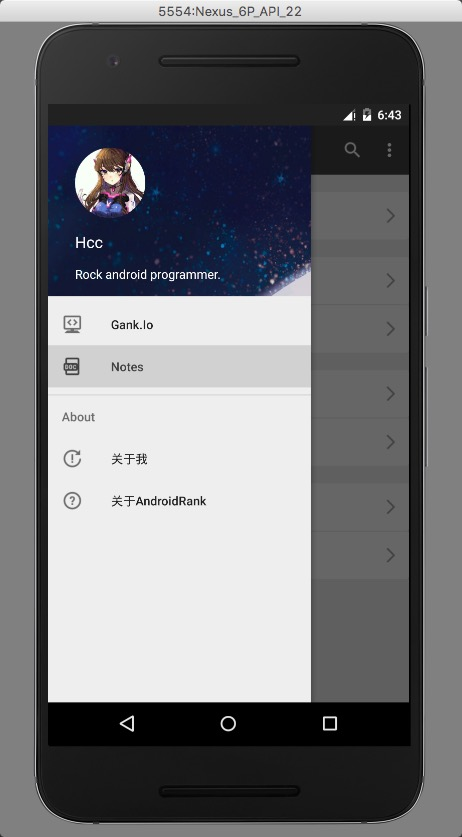</a>

<a href="art/07.png">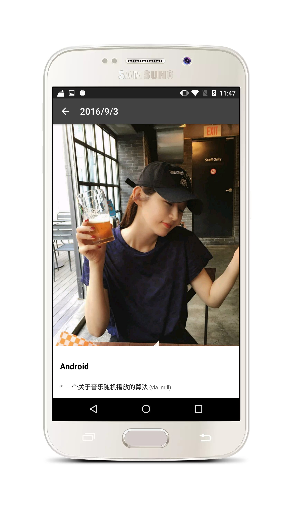</a> <a href="art/08.png">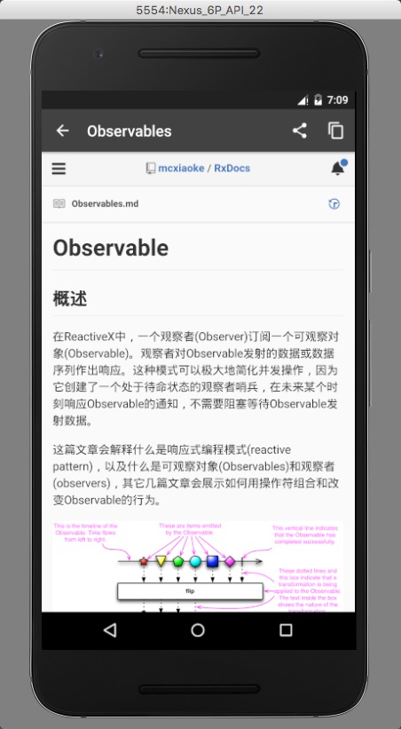</a>

<a href="art/09.png">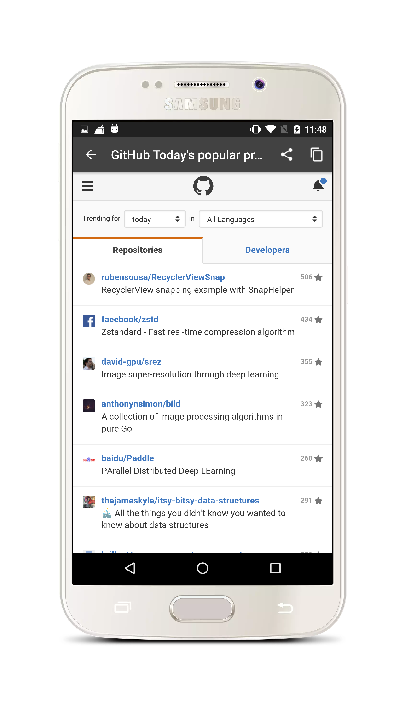</a> <a href="art/10.png">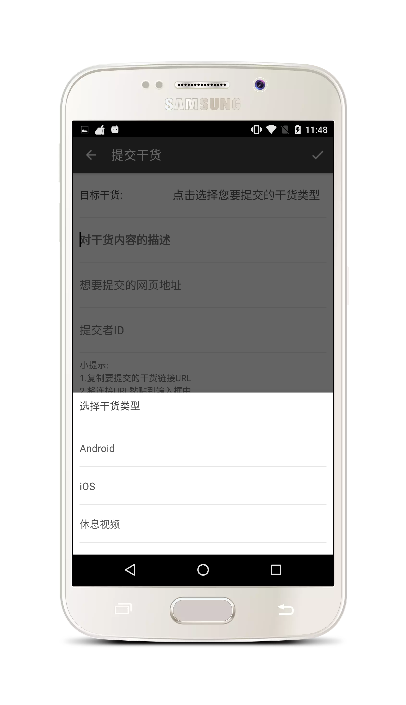</a>

<a href="art/11.png">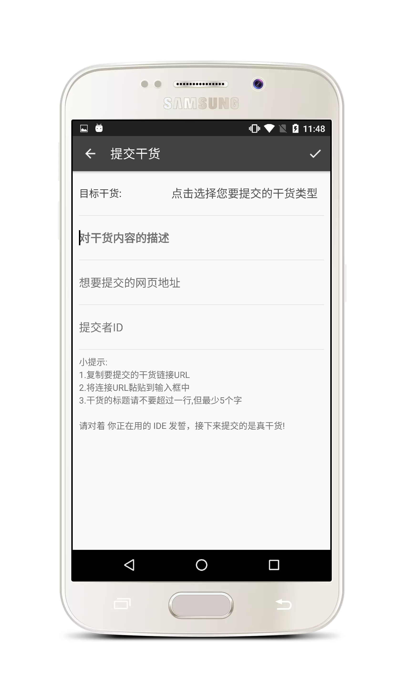</a> <a href="art/12.png">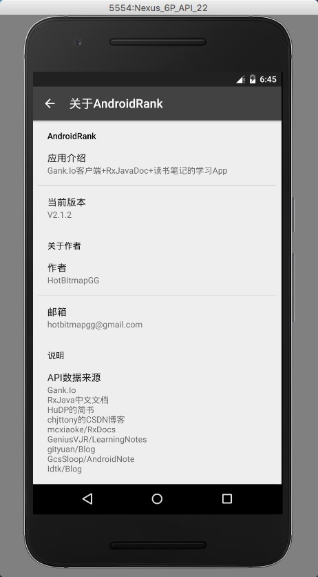</a>

<a href="art/13.png">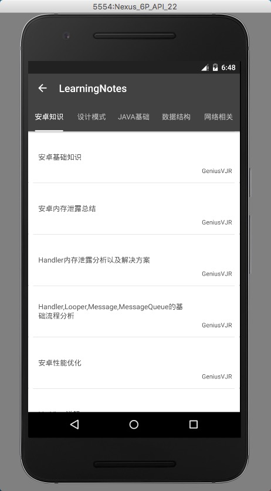</a>

## 感谢

* Rxjava中文文档,地址: [mcxiaoke/RxDocs](https://github.com/mcxiaoke/RxDocs)
* 安卓面试整理资料,地址: [GeniusVJR/LearningNotes](https://github.com/GeniusVJR/LearningNotes)
* Gityuan大神博客,地址: [gityuan/Blog](http://gityuan.com/)
* 安卓笔记,地址: [GcsSloop/AndroidNote](https://github.com/GcsSloop/AndroidNote)
* 自定义控件笔记,地址: [Idtk/Blog](https://github.com/Idtk/Blog)
* 安卓开发艺术探索读书笔记,地址: [简书](http://www.jianshu.com/p/eb3247fac29a)
* EffectiveJava读书笔记,地址: [CSDN](http://blog.csdn.net/chjttony/article/category/1311991)

## About me

An android developer in Wuhan.

If you want to make friends with me, You can focus on my weibo.

## License

 Copyright 2017 HotBitmapGG

 Licensed under the Apache License, Version 2.0 (the "License"); you may not use this file except in compliance with the License. You may obtain a copy of the License at

 http://www.apache.org/licenses/LICENSE-2.0

 Unless required by applicable law or agreed to in writing, software distributed under the License is distributed on an "AS IS" BASIS, WITHOUT WARRANTIES OR CONDITIONS OF ANY KIND, either express or implied. See the License for the specific language governing permissions and limitations under the License.

